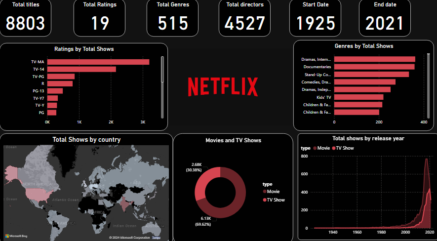

# Netflix_Dashboard

# Netflix Dashboard

This project is a Netflix Dashboard created using Power BI, utilizing a dataset containing various parameters such as show ID, type, title, director, cast, country, release year, rating, duration, listed end, description, and more.

## Overview

The dashboard provides insightful visualizations and metrics related to the Netflix dataset, helping users understand the distribution and characteristics of titles available on Netflix.

## Features

- **Total Titles**: Displays the total number of titles in the dataset.
- **Total Ratings**: Shows the total count of ratings available.
- **Total Genres**: Represents the number of unique genres.
- **Total Directors**: Indicates the total number of directors.
- **Start Date & End Date**: Shows the range of release years covered in the dataset.

### Visualizations

1. **Bar Graph - Ratings by Total Shows**: Visualizes the distribution of ratings across the total number of shows.
2. **Bar Graph - Genres by Total Shows**: Displays the count of shows for each genre.
3. **Map Graph - Total Shows by Country**: A geographical representation showing the number of shows produced by each country.
4. **Donut Graph - Movies and TV Shows**: A circular chart showing the proportion of movies versus TV shows.
5. **Area Graph - Total Shows by Release Year**: An area graph illustrating the number of shows released each year.

## Dataset

The dataset used in this project contains the following parameters:

- Show ID
- Type
- Title
- Director
- Cast
- Country
- Release Year
- Rating
- Duration
- Listed End
- Description

## Usage

To use this dashboard, you need Power BI installed on your machine. Follow the steps below to get started:

1. **Clone the repository**:
    ```sh
    git clone https://github.com/yourusername/netflix-dashboard.git
    ```

2. **Open the Power BI file**:
    Open the `NetflixDashboard.pbix` file in Power BI Desktop.

3. **Explore the Dashboard**:
    Navigate through the various visualizations to explore the insights derived from the Netflix dataset.

## Screenshots




## Contact

For any questions or suggestions, feel free to reach out:

- Name: Neha
- Email: nehaannie2002@gmail.com
